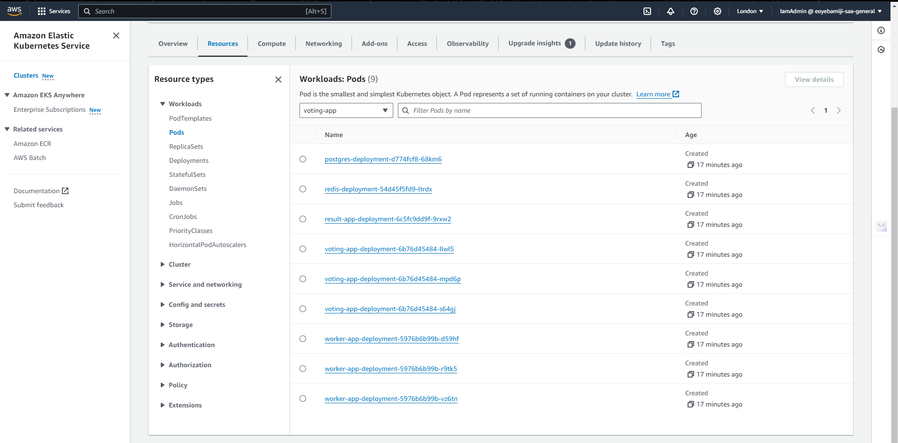
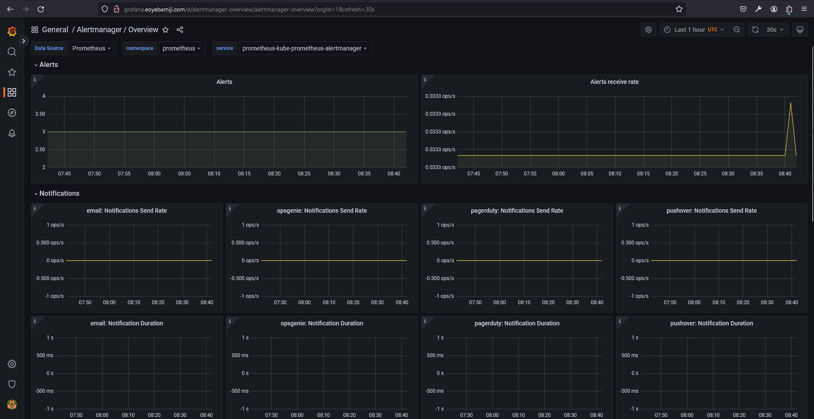

# AltSchool SOE: Cloud Engineering Capstone Project

## Microservices: Automating The Deployment of Socks Shop on Kubernetes Using Terraform and Jenkins

### Project Overview

This project aims to deploy a microservices-based application, Socks Shop, using a modern approach that emphasizes automation and efficiency. The goal is to use Infrastructure as Code (IaC) for rapid and reliable deployment on Kubernetes. To create a reproducible and maintainable deployment process that leverages modern DevOps practices and tools.

#### Project Objective

- Microservices Deployment: Deploy the Socks Shop, showcasing a microservices architecture that brings flexibility and scalability.

- Infrastructure as Code (IaC): Automate the deployment process by adopting IaC principles thereby ensuring rapid deployment, consistency and efficiecny.

- Implement monitoring, logging, and security measures to enhance the application's operational aspects.

#### Tools Utilised

- IaaC - AWS
- IaC - Terraform
- CI/CD - Jenkins
- Orchestration - Kubernetes (AWS Elastic Kubernetes Service - EKS)

#### Prerequisites

- AWS Account
- GitHub Account
- AWS CLI
- Terraform

#### Getting Started

To utilize this repository, follow these steps:

1. Login to your AWS account and create a new Instance with the name "Jenkins-Server" (Any name of choice surficces). This is where our Jenkins server will be hosted.


2. Upon creation of the instance, connect to the instance and clone this repository into the created instance.

```bash
git clone https://github.com/EOyebamiji/capstone.git
```


3. After cloning the repository, kindly navigate into the cloned repository and execuste the `script.sh` by following the below command

```bash
cd capstone     #Chnage directory into the repository

chmod +x ./script.sh    #This is a bash script to automate the installation of the project tools requirements and dependencies e.g. AWS CLI, terraform, helm, jenkins etc. This command will set this script to be executable by all users.

./script.sh     #This command will execute the script and install the project tools requirements and dependencies. Kindly press enter where necessary to run the script.
```


4. Upon completion, the script will have installed the project tools requirements and dependencies. next step is to copy the public IP address of the "Jenkins-Server" instance and input into our browser to access our Jenkins server e.g. `18.171.172.160:8080`.


5. Access the Jenkins server's login credentials from  `/var/lib/jenkins/secrets/initialAdminPassword` using the command:

```bash
sudo cat /var/lib/jenkins/secrets/initialAdminPassword
```


6. Access and Unlock Jenkins using the password, install necessary dependencies, and set up an administrative account for login.


Input the password copied from the directory `/var/lib/jenkins/secrets/initialAdminPassword` and unlock the server. Install the Jenkins server dependencies and setup an admiministrative account for Login.


Configure credentials in the Jenkins server to connect to endpoints - GitHub and AWS accounts.


After adding necessary credentials, create the first pipeline for the EKS (Elastic Kubernetes Service) Cluster, which will host the microservices application.

## EKS Cluster Creation


Configure the pipeline, pointing to the GitHub repository and using the `cluster-Jenkinsfile`script.


Save the configuration and build the pipeline.


After a successful build, validate the EKS cluster's configuration and deployed resources on AWS.


Verify the successful deployment of the EKS cluster and its dependencies on AWS.


## Microservices Application Creation

After deploying the EKS Cluster, create the Microservices Application pipeline following similar steps as the EKS pipeline. Set the script path to `Jenkinsfile` when configuring the pipeline.


After a successful deployment of the Microservices application, validate the resources and configurations on AWS.

### Microservices Deployment Confirmation





### Deployed Application


### Grafana Monitoring Application





Now that the application is confirmed working, the next step is to destroy resources and clean up the environment to avoid unnecessary costs.

### Destroy Pipelines

First, destroy the Microservices pipeline.


Next, destroy the EKS Cluster pipeline.


Finally, delete the AWS Instance housing the Jenkins-Server.


Here is the end of the deployment of the microservices application (Sockshop) in a Kubernetes cluster using Terraform and Kubernetes is now complete.

### Extras

I made an attempt to recreate the CI/CD pipeline using GitHub Actions; however, the deployment was not completed. The pipeline triggers but deployment fails as terrafrom level. It doesn't recongize resources it created, hence, difficult to run updates without access to statefile. A few tweaks here and there should resolve this. You can access it [here](.github/workflows/eks-cluster.yml)


### Resources

[Sock Shop Microservices App](https://github.com/microservices-demo/microservices-demo.github.io)

[Sock Shop Implementation Guide](https://github.com/microservices-demo/microservices-demo/tree/master)

[Architecture](assets/Architecture.png)